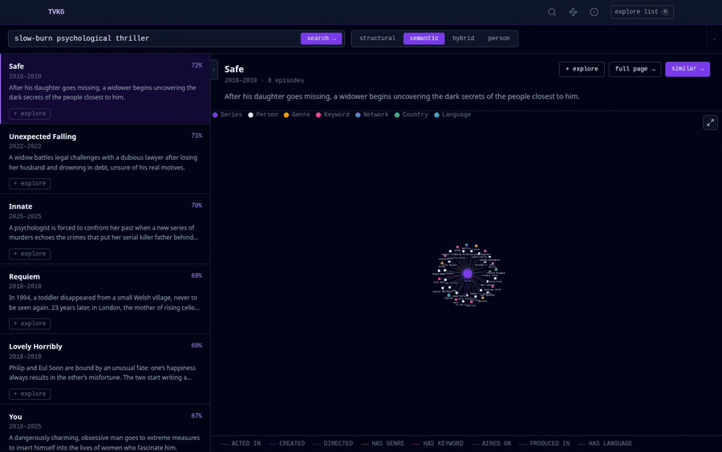
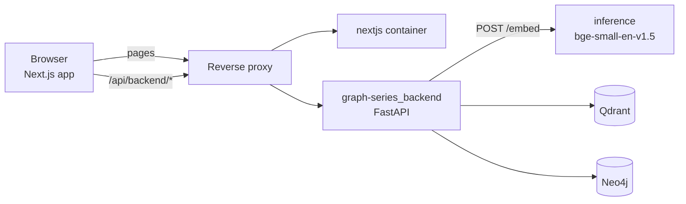
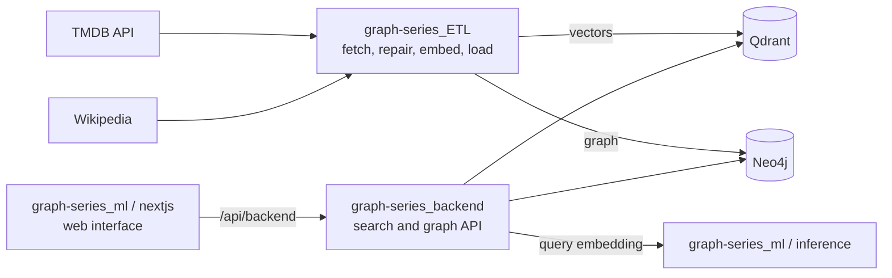

# Graph Series Explorer

Web interface of **Graph Series**: search about 56,000 TV series by meaning, title or person, then build a knowledge graph on a canvas by expanding any node into its cast, creators, genres, keywords, networks, countries and languages.

Live deployment: <https://graph-series.katzer.ru/> (it may run an earlier build than this repository).


*The explore workspace, captured on 2026-10-04 from a local build of this repository reading the public deployment. Violet nodes are series, white are people, amber genres, pink keywords. Amber-ringed nodes can still be expanded. 150 nodes at this point; the selected node (Bryan Cranston) has 22 connections.*

> This product uses the TMDB API but is not endorsed or certified by TMDB.

## What this project demonstrates

- **Three ways in, one data model.** Series are found by meaning (`semantic`, a free-text description such as "slow-burn psychological thriller"), by title (`structural`), by a blend (`hybrid`) or by person. For example, the query `space western` returns *Cowboy Bebop* first with cosine score 0.717 (live response 2026-10-04, [`search-semantic-space-western.json`](docs/examples/search-semantic-space-western.json)).
- **A graph that grows on demand.** One series has a depth-1 neighbourhood of 66 nodes and 67 edges (Breaking Bad, 2026-10-04); expanding a node merges its neighbours into the existing picture instead of redrawing it. Seven node types and eight relationship types ([architecture](docs/architecture.md#data-model-the-ui-works-with)).
- **Tools for dense graphs.** Four layouts (force, hierarchy, circle, concentric), a 3D view, type filters, a node navigator with a list and a three-level hierarchy, selection history and keyboard shortcuts ([features](docs/features.md#graph-node-navigator)).
- **Query embedding done correctly.** A small CPU service encodes queries with the `bge-small-en-v1.5` retrieval instruction that the indexed documents were encoded without ([why](docs/design-decisions.md#queries-are-embedded-with-the-bge-instruction-documents-are-not)).
- **A workspace that survives reloads.** The bookmark list, the explore graph with positions, layout, filters and panel sizes are saved in the browser; the bookmark list and the graph are independent ([what is saved](docs/features.md#what-is-saved-in-the-browser)).
- **Honest edges.** The Methodology page states data limits, and this README lists where the interface and the live deployment fall short ([Limitations](#limitations)).

## Contents

[Idea](#idea) · [Features](#features) · [How it works](#how-it-works) · [Results and evaluation](#results-and-evaluation) · [Quick start](#quick-start) · [Usage examples](#usage-examples) · [Configuration](#configuration) · [API used](#api-used) · [Repository layout](#repository-layout) · [Tests and quality](#tests-and-quality) · [Deployment](#deployment) · [Limitations](#limitations) · [Related repositories](#related-repositories) · [License and attribution](#license-and-attribution)

## Idea

TV catalogues are good at "find the show called X" and poor at "find something like the feeling of Y" or "who else worked with this actor". Graph Series combines two kinds of retrieval over the same TMDB data:

1. **Vector search** over embeddings of each show's title, overview and keywords, for mood and theme.
2. **A property graph** of series, people, genres, keywords, networks, countries and languages, for explicit relationships.

The interface is where the two meet: a result found by meaning can be dropped on the explore canvas and expanded through its relationships, and a person or a keyword can be the starting point just as well. Ranking is kept explainable: in hybrid mode a card shows the semantic score together with the number of shared actors and countries instead of one opaque number.

## Features

Every page, control and shortcut is described in [`docs/features.md`](docs/features.md). Summary:

| Area | What it does | Evidence |
|---|---|---|
| **Home** | search box, six example queries, explanation of semantic, graph and hybrid search | [`home.png`](docs/media/home.png) |
| **Search** | four modes (`semantic` default, `structural`, `hybrid`, `person`); query and selection in the URL; results with a live mini graph; `+ explore` on every card; visible error messages | [`search-semantic.png`](docs/media/search-semantic.png), [`search-hybrid.png`](docs/media/search-hybrid.png), [`search-structural.png`](docs/media/search-structural.png), [`search-person.png`](docs/media/search-person.png) |
| **Series page** | metadata, poster, genres, keywords, networks, countries, languages, cast and crew, depth 1 or 2 graph (`?depth=2`), bookmarks on every facet | [`series-breaking-bad.png`](docs/media/series-breaking-bad.png) |
| **Person page** | series grouped by role (creator, director, actor) and the person's co-worker graph | [`person-bryan-cranston.png`](docs/media/person-bryan-cranston.png) |
| **Similar** | `semantic` or `hybrid` neighbours of a series with similarity badges and a graph per result | [`similar-breaking-bad.png`](docs/media/similar-breaking-bad.png) |
| **Explore canvas** | start from a series or person, double-click or Enter to expand, remove nodes, clear graph, hover highlighting | [`explore-workflow.gif`](docs/media/explore-workflow.gif) |
| **Layouts and views** | force (Cytoscape `cola`), hierarchy (`dagre`), circle, concentric; 2D or 3D | [`explore-layout-concentric.png`](docs/media/explore-layout-concentric.png), [`explore-3d.png`](docs/media/explore-3d.png) |
| **Node navigator** | all nodes as a sortable, filterable list or as a Genre/Keyword/… → Series → Person tree; tree view of the selection | [`navigator-keys.gif`](docs/media/navigator-keys.gif) |
| **Keyboard** | `↑ ↓` walk the list, `Enter` expand or descend, `Esc` parent, `H` home, `T` tree, `Alt+← →` history | [features](docs/features.md#graph-node-navigator) |
| **Explore list** | bookmarks of series, people and facets, shared across pages and tabs | [`search-to-explore.gif`](docs/media/search-to-explore.gif) |
| **Mini graphs** | click or tap a node to open it, Ctrl/Cmd+click for a new tab, fullscreen, hover dimming | [features](docs/features.md#mini-graphs) |
| **Panels** | resizable, collapsible side panels and top bars with remembered state | [features](docs/features.md#what-is-saved-in-the-browser) |
| **Mobile layout** | portrait phones get list-then-detail flows, off-canvas drawers and pinch zoom | [`mobile-search-detail.png`](docs/media/mobile-search-detail.png), [`mobile-explore-graph.png`](docs/media/mobile-explore-graph.png) |
| **Methodology page** | data sources, embeddings, graph, hybrid similarity, limitations | [`methodology.png`](docs/media/methodology.png) |



*Two results are bookmarked with `+ explore` on the search page; the header menu shows the list, and `open explore →` goes to the canvas.*

## How it works



The browser loads the app and calls the API on its own origin under `/api/backend`; a reverse proxy forwards that path to the backend, which embeds the query through the `inference` service here, searches Qdrant and reads Neo4j. Components, data flows, the data model and the explore page internals: [`docs/architecture.md`](docs/architecture.md).

**Key design decisions** (reasoning and alternatives: [`docs/design-decisions.md`](docs/design-decisions.md)):

- **Graph node ids are `label:key`** (`series:1399`, `person:1399`), because TMDB ids of different entities collide. Routes and API calls use the native key.
- **The explore canvas is the model.** Cytoscape holds the graph; React state is derived from it, expansions merge into it, and the whole thing is saved after every change.
- **Mini graphs and the explore canvas use different renderers** (`react-force-graph-2d` and Cytoscape.js), plus `react-force-graph-3d` for the 3D toggle.
- **Touch and keyboard handling is written by hand where libraries fell short:** node hit-testing on mini graphs, double-tap on the canvas, index-based navigation through a tree where nodes can repeat.
- **One file for every tunable value** (`nextjs/lib/constants.ts`).
- **Same-origin API path and a standalone Next.js build**, so the browser never meets the API server's own certificate and the image stays small.

## Results and evaluation

This repository contains no retrieval or ranking evaluation: it is the interface and the query-embedding service. The evaluations live next to the code they measure:

- the effect of graph re-ranking in hybrid mode (genre overlap@10, paired bootstrap interval) is in [`graph-series_backend`](https://github.com/GKatzer/graph-series_backend#does-the-graph-re-ranking-help);
- retrieval quality of the embeddings and the data pipeline is in [`graph-series_ETL`](https://github.com/GKatzer/graph-series_ETL).

What can be said from the interface itself is limited to the measurements below, taken on 2026-10-04 against the public deployment:

| Measure | Value | Source |
|---|---|---|
| Depth-1 graph of Breaking Bad | 66 nodes, 67 edges | [`graph-series-1396-depth1.counts.json`](docs/examples/graph-series-1396-depth1.counts.json) |
| Production build, first-load JS for `/explore` | 137 kB (shared by all pages: 101 kB) | `npm run build` output |
| Semantic search request time from this machine | about 1.3 to 2.3 s per request (a few requests, not a benchmark) | `curl` timings |

## Quick start

Requirements: Node.js 20 or newer and npm (checked here with Node 26.10.0 and npm 11.19.1). The interface needs a backend that implements the [API it calls](docs/api.md); there is no mock mode. Two ways to get one:

**A. Against your own backend** ([`graph-series_backend`](https://github.com/GKatzer/graph-series_backend) with Neo4j and Qdrant loaded by [`graph-series_ETL`](https://github.com/GKatzer/graph-series_ETL)):

```bash
git clone https://github.com/GKatzer/graph-series_ml.git
cd graph-series_ml/nextjs
npm ci
NEXT_PUBLIC_API_URL=http://localhost:8000 npm run dev      # http://localhost:3000
npm run type-check                                          # tsc --noEmit
npm test                                                    # 51 unit tests, about 1 s
```

The backend allows cross-origin calls only from the origins in its `CORS_ORIGINS_RAW` setting (default includes `http://localhost:3000`), so run the dev server on port 3000 or extend that list.

**B. Against the public deployment, read-only.** The deployed API is on the same origin as the site, so run the app with the default `/api/backend` base and forward that path with the small proxy in `docs/examples/`:

```bash
cd nextjs && npm ci && npm run build
NEXT_TELEMETRY_DISABLED=1 npm start &          # :3000 (Next.js prints a warning about standalone output; the server still starts)
node ../docs/examples/dev-proxy.mjs &          # :3100, forwards /api/backend to the public site, GET only
# open http://127.0.0.1:3100
```

Verified output of the pieces (clean copy, 2026-10-04):

```text
$ npm ci          → installs; npm reports 19 vulnerabilities (see Limitations)
$ npm run type-check
> tsc --noEmit    → exits 0 without output
$ npm run build
 ✓ Compiled successfully … ✓ Generating static pages (7/7)
┌ ○ /                       3.52 kB   108 kB
├ ○ /explore                10.9 kB   137 kB
├ ○ /methodology            173 B     104 kB
├ ƒ /person/[id]            2.05 kB   132 kB
├ ○ /search                 4.74 kB   135 kB
├ ƒ /series/[id]            3.33 kB   133 kB
└ ƒ /similar/[id]           3.23 kB   133 kB
$ npm run dev -- -p 3002
 ✓ Ready in 3.1s
 GET / 200 …   GET /explore 200 …
```

The embedding service and Qdrant are only needed when you run the whole system yourself. The embedding service runs on its own (checked 2026-10-04, Python 3.12):

```bash
cd inference && uv venv --python 3.12 .venv && uv pip install --python .venv/bin/python -r requirements.txt
.venv/bin/uvicorn main:app --port 8010 &          # downloads the model on first start
curl -s localhost:8010/health
# {"status":"ok","model":"BAAI/bge-small-en-v1.5","loaded":true}
curl -s -X POST localhost:8010/embed -H 'Content-Type: application/json' -d '{"text":"space western"}'
# {"vector":[-0.0263…, -0.0325…, 0.0201…, …]}      384 numbers, L2 norm 1.0
```

Qdrant and the rest of the stack: [deployment](docs/deployment.md) (not run here: no Docker and no private network in the environment used for this README).

## Usage examples

The interface is used in the browser; its data layer can be exercised with `curl` against the public deployment (real, trimmed responses are in [`docs/api.md`](docs/api.md)):

```bash
curl -s https://graph-series.katzer.ru/api/backend/health
# {"status":"ok","uptime_s":1135596}

curl -s 'https://graph-series.katzer.ru/api/backend/api/search?q=space%20western&mode=semantic&limit=3'
# {"query":"space western","mode":"semantic","results":[{"tmdb_id":30991,"name":"Cowboy Bebop", … "score":0.717…}, …],"total":3}

curl -s 'https://graph-series.katzer.ru/api/backend/api/graph/series/1396?depth=1'
# {"nodes":[{"id":"series:1396","key":1396,"label":"Series","name":"Breaking Bad", …}, …], "edges":[…]}   (66 nodes, 67 edges)
```

Typical interactive sessions:

1. **From a mood to a graph.** Search `slow-burn psychological thriller` (semantic), open a result, press `+ explore`, open `/explore`, add the series from the explore list with `+`, double-click its keyword nodes to see which other series share them.
2. **From a person.** In `/explore` choose `person`, type a name, pick one: the canvas shows their series; expand a series to see the rest of its cast. (Person search was failing on the deployment earlier on 2026-10-04, see [Limitations](#limitations); it works since the fix.)
3. **Walking a dense graph.** Open the node navigator, switch to `hierarchy`, press `↓` to move through the top-level nodes, `Enter` to expand or go deeper, `Esc` to go up, `T` to see parents, siblings and children.


*Start from a series, select a person in the navigator, expand with Enter, fit the view, switch to the concentric layout (recorded 2026-10-04 against the public deployment).*

## Configuration

| Name | Meaning | Default | Required |
|---|---|---|---|
| `NEXT_PUBLIC_API_URL` | base URL of the API as the browser sees it; inlined at build time (also a Docker build argument) | `/api/backend` | no |

That is the only variable the application code reads (`next.config.js`, `nextjs/lib/api.ts`; checked with `grep`). `docker-compose.yml` additionally requires `PRIVATE_BIND_IP` (the address on the private network on which Qdrant and the embedding service are published). Settings of the services and scripts (ports, collection name, backup retention) are listed in [`docs/deployment.md`](docs/deployment.md#configuration). The backend has its own settings (databases, CORS origins) in its repository.

## API used

The interface calls eight `GET` endpoints of the backend (search, person search, series, similar, series graph, person, person graph, hub-node graph) and nothing else; the embedding service is called by the backend, not by the browser. Parameters, defaults, real responses and the failures observed: [`docs/api.md`](docs/api.md).

## Repository layout

```
graph-series_ml/
├── nextjs/                      the web interface (Next.js 15, React 19, TypeScript, Tailwind CSS 3)
│   ├── app/                     routes (App Router)
│   │   ├── page.tsx             home
│   │   ├── search/              four-mode search
│   │   ├── series/[id]/         series detail + graph (depth 1 or 2)
│   │   ├── person/[id]/         person detail + graph
│   │   ├── similar/[id]/        semantic or hybrid neighbours of a series
│   │   ├── explore/             the graph canvas, node navigator, selection history (2,046 lines)
│   │   ├── methodology/         static page: data, method, limits
│   │   ├── layout.tsx           header, explore-list menu, toasts
│   │   └── globals.css          Tailwind layers, scrollbar, selection colours
│   ├── components/
│   │   ├── SeriesGraph.tsx      force-graph renderer for mini graphs, legends, fullscreen
│   │   ├── ResizablePanel.tsx   resizable, collapsible side panel (drawer on mobile)
│   │   ├── CollapsibleTopBar.tsx
│   │   ├── ExploreMenu.tsx      header menu with the bookmark list
│   │   └── TitleSetter.tsx
│   ├── lib/
│   │   ├── api.ts               typed client for the backend
│   │   ├── types.ts             response types
│   │   ├── constants.ts         every tunable value (colours, physics, layouts, limits, keys)
│   │   ├── nodeId.ts            "label:key" node ids and ISO code display names
│   │   ├── exploreStore.ts      bookmarks and saved graph in localStorage
│   │   ├── useIsMobile.ts       narrow-and-portrait detection
│   │   ├── titleContext.tsx, utils.ts
│   ├── tests/                   Vitest unit tests (6 files, 51 tests) and a localStorage shim
│   ├── vitest.config.ts
│   ├── Dockerfile               multi-stage build, standalone output, non-root runtime
│   └── next.config.js, tailwind.config.ts, tsconfig.json, package.json, package-lock.json
├── inference/                   query-embedding service
│   ├── main.py                  FastAPI: POST /embed, GET /health
│   ├── requirements.txt         fastapi, uvicorn, sentence-transformers, torch (CPU)
│   ├── requirements-dev.txt     adds pytest and httpx
│   ├── tests/test_embed.py      9 tests with a stub model
│   └── Dockerfile               downloads the model at build time
├── scripts/                     init_qdrant.py, backup_qdrant.sh, deploy.sh, setup_tailscale_firewall.sh, tvkg-vds2.service
├── docker-compose.yml           Qdrant + web app + embedding service
├── docs/
│   ├── features.md              every page and control
│   ├── architecture.md          components, flows, data model, explore internals
│   ├── design-decisions.md      decisions, reasons, changed or dropped ideas
│   ├── api.md                   endpoints used, real responses, failures observed
│   ├── deployment.md            topology, services, setup, operations, inconsistencies
│   ├── examples/                captured API responses, dev proxy, capture script
│   └── media/                   screenshots and GIFs
├── .env.example                 NEXT_PUBLIC_API_URL, PRIVATE_BIND_IP
└── LICENSE
```

## Tests and quality

Two small suites, both fast and both independent of any server. They were added on 2026-10-04; before that the repository had no automated tests.

**Web interface: Vitest 3 with jsdom** (`nextjs/tests/`):

```bash
cd nextjs && npm ci && npm test
```
```text
 ✓ tests/constants.test.ts (4 tests)
 ✓ tests/api.test.ts (13 tests)
 ✓ tests/utils.test.ts (5 tests)
 ✓ tests/nodeId.test.ts (9 tests)
 ✓ tests/exploreStore.test.ts (13 tests)
 ✓ tests/buildGraphData.test.ts (7 tests)
 Test Files  6 passed (6)
      Tests  51 passed (51)
   Duration  969ms
```

| File | What it pins down |
|---|---|
| `nodeId.test.ts` | `label:key` ids: prefix, first-colon split, round trip, series and person with the same key stay different, ISO code display names with fallback |
| `exploreStore.test.ts` | bookmark list (add once, toggle, remove, clear, versioned key, same-tab and cross-tab notifications, corrupt JSON), saved graph, `clear graph` leaving bookmarks alone, legacy keys purged on load |
| `api.test.ts` | every request URL and default (`limit` 20/10/8/50, depth, mode, encoding of `&`, `=`, `/`, spaces), `ApiError` with the HTTP status, `failureMessage` text |
| `utils.test.ts` | `formatScore` per mode (percentage, number above 1, full-text number), `cn` merging |
| `buildGraphData.test.ts` | degree counting, centre and degree-based node sizes, colour fallbacks for unknown labels and relationship types, country names |
| `constants.test.ts` | every label has a colour, an API path and unique storage keys, and the eight relationship types are all coloured |

Mutation check: changing `keyOfNodeId` to split on the last colon made `nodeId.test.ts` fail on the "first colon only" test, and restoring it made the suite pass again.

**Embedding service: pytest with a stub model** (`inference/tests/test_embed.py`, 9 tests, 0.45 s). The stub replaces `sentence_transformers` before `main` is imported, so neither `torch` nor the weights are needed:

```bash
cd inference && uv venv --python 3.12 .venv && uv pip install --python .venv/bin/python -r requirements-dev.txt
.venv/bin/python -m pytest -q
# 9 passed, 1 warning in 0.45s
```

It checks that a query gets the retrieval instruction, that `is_query` defaults to true, that an already prefixed text is not prefixed twice, that documents (`is_query: false`) are encoded as they are, that the vector has 384 numbers and unit length, that the model is loaded on CPU, that `/health` reports it, and that a body without `text` gets 422. It does not test the real model; the real service was run once by hand (see Quick start).

**Type check and build:** `npm run type-check` and `npm run build` pass (see Quick start).

**Not covered:** React components and pages (nothing renders a page in a test), the explore canvas, the node navigator and its keyboard rules (the logic lives inside the 2,046-line page and has to be extracted before it can be unit-tested), the 3D view, the backend responses (all API calls are mocked), and any end-to-end flow. There is no CI workflow in the repository, so these commands have only been run locally; `npm run lint` was not run (no ESLint configuration is committed).

## Deployment

Two servers on a private network: the web server runs this repository's compose file (Qdrant, the app, the embedding service) behind a reverse proxy; the API server runs the backend and Neo4j. Ports, systemd unit, firewall rules, backups, the deploy script and the inconsistencies found in these files are in [`docs/deployment.md`](docs/deployment.md). The deployment steps were not run in this environment.

## Limitations

Checked on 2026-10-04 unless stated otherwise.

**On the deployment.**

- **History.** On 2026-10-04 `structural` and person search answered HTTP 500 for every query ([transcript](docs/examples/live-errors-2026-10-04.txt)): the Neo4j full-text indexes `series_name_idx` and `person_name_idx` were missing. They are created only by the backend's `scripts/schema_init.cypher`, which has to be re-run after every graph reload. The owner re-ran it the same day and both modes answered 200 afterwards (first request right after creation still failed while the indexes were `POPULATING`). The interface then showed such failures as "No results"; since the fix of the same day it shows `Search failed (HTTP 500), try again`.
- **Latency varies a lot.** Typical requests took 1.3 to 3 s; one hub-graph request took 12 s, a hybrid request 11 s, and an earlier hybrid request timed out at 20 s (2026-10-04).
- `/api/healthz`, which the compose health check and `deploy.sh` poll, still answers 404.

**In the interface.**

- **Scores mean different things per mode.** Semantic is cosine similarity (a percentage), hybrid is cosine similarity plus graph bonuses and can exceed 1 (Breaking Bad's top neighbour: 1.02), structural is the database's full-text relevance. The interface shows each in its own form (`hybrid score 1.02`); earlier builds showed all of them as a percentage labelled "semantic". `cytoscape-fcose` stays in `package.json` unused (the `force` layout is `cola`).
- **3D view** is read-only (no expansion, no selection).
- **`hierarchy` layout** turns a star-shaped graph into two long rows ([`explore-layout-hierarchy.png`](docs/media/explore-layout-hierarchy.png)).
- Failed saves to `localStorage` (quota) are still ignored silently, so a very large explore graph may stop being persisted without notice.
- The person header counts one row per role ("22 series" for a person whose search entry says 17).
- Posters are loaded by the browser straight from TMDB's image CDN.

**Data** (from the Methodology page; the data is loaded by `graph-series_ETL`): TMDB coverage is uneven (about half of the shows have cast, under a third have keywords), at most 20 cast members and 10 directors are kept per show, the embedding model is English-only, and the index is a snapshot, not a live feed. The counts of about 230,000 fetched, 211,000 indexed and 56,000 graph series come from code comments and the Methodology page and were not recounted here.

**Dependencies.** `npm audit` on the lockfile reports 19 vulnerabilities (1 low, 4 moderate, 13 high, 1 critical); the critical one is in Next.js 15.2.4 itself, and two moderate ones came with the test tooling (`vitest`, dev only). Not addressed here.

**Not verified in this environment.** Every Docker, firewall, systemd and reverse-proxy step: there is no Docker, no private network and no second server here. The deployment files also disagree with each other in places ([list](docs/deployment.md#known-inconsistencies-in-the-deployment-files)).

## Related repositories

**Graph Series** is a search and exploration system for about 56,000 TV series. It is built from three repositories that form one pipeline: a data pipeline fills a vector index and a graph database, an API combines the two stores, and a web interface (with the query-embedding service) sits on top.



| Repository | Role |
|---|---|
| [`graph-series_ETL`](https://github.com/GKatzer/graph-series_ETL) | data pipeline: TMDB fetching, Wikipedia fallback for thin descriptions, embeddings, loading of Qdrant and Neo4j, retrieval evaluation |
| [`graph-series_backend`](https://github.com/GKatzer/graph-series_backend) | API over both stores: `semantic`, `structural`, `hybrid` and person search, similar series, graph endpoints, evaluation of the graph re-ranking |
| `graph-series_ml` (this) | web interface (Next.js), query-embedding service, Qdrant deployment |

Shared terms: **semantic** search ranks by cosine similarity of embeddings; **structural** search is a full-text match on titles in Neo4j; **hybrid** adds graph bonuses (shared cast, shared country) to the semantic score; **Hit@k** is the share of queries whose target series is among the top k results and **MRR** is the mean of 1/rank of the target. The key of a series is its TMDB id (`tmdb_id`) in every store.

Shared numbers (identical in the READMEs of all three repositories; the retrieval figures come from `graph-series_ETL`, the re-ranking figures are recomputed from the committed CSV in `graph-series_backend`): about 230,000 series fetched, about 211,000 in the vector index, about 56,000 in the graph (at least two votes). Title-as-query retrieval over 500 random series on 2026-10-01: Hit@1 0.606 (0.642 excluding titles shared with another series), Hit@10 0.716, MRR 0.648 (0.680). Graph re-ranking in hybrid mode: genre overlap@10 0.764 to 0.774, a paired difference of +0.0095 (95 % bootstrap interval +0.001 to +0.019).

## License and attribution

License: MIT, see LICENSE.
Author: George Denisov · [GitHub](https://github.com/GKatzer) · [Telegram](https://t.me/denisov_george)

This product uses the TMDB API but is not endorsed or certified by TMDB. Series data, posters and links come from [TMDB](https://www.themoviedb.org); the embedding model is [`BAAI/bge-small-en-v1.5`](https://huggingface.co/BAAI/bge-small-en-v1.5); vectors are stored in [Qdrant](https://qdrant.tech).
