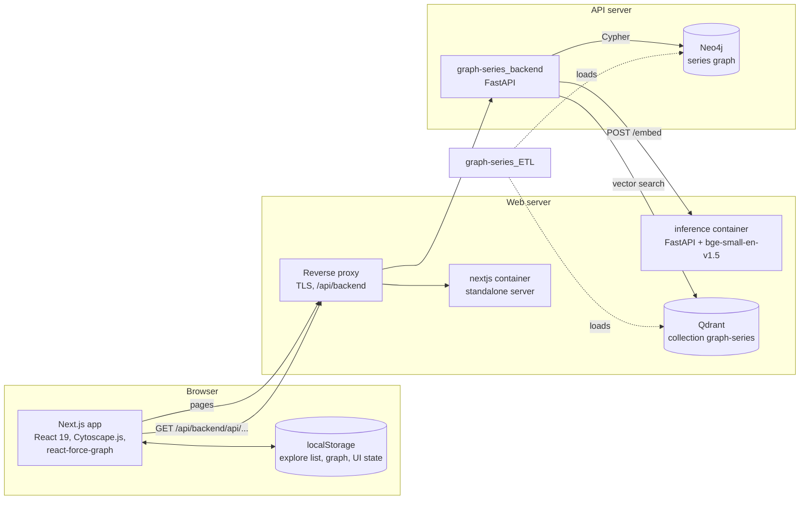
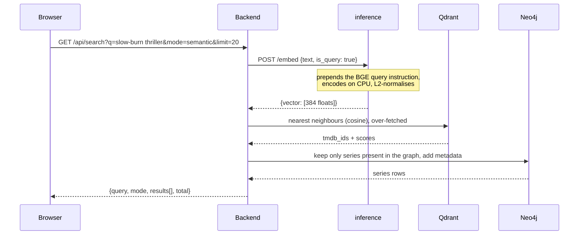

# Architecture

How the pieces of Graph Series fit together, with the data flows that matter for this repository: the web interface (`nextjs/`), the query-embedding service (`inference/`) and the Qdrant deployment (`docker-compose.yml`, `scripts/`).

## Components



- **Browser.** Pages are client-rendered; every request goes to the backend through the same origin under `/api/backend`, so the browser never talks to the API server directly (and never sees its certificate). There is no server-side data fetching in this app: `lib/api.ts` runs in the browser.
- **Web server.** Runs three containers: the Next.js standalone server, the embedding service and Qdrant, plus a reverse proxy that is described in the deployment notes but is not part of this repository ([deployment.md](deployment.md)).
- **API server.** [`graph-series_backend`](https://github.com/GKatzer/graph-series_backend) with Neo4j. It calls the embedding service, queries Qdrant and Neo4j, and returns typed JSON.
- **Data.** [`graph-series_ETL`](https://github.com/GKatzer/graph-series_ETL) fetches TMDB data and loads both stores. The key of a series is its `tmdb_id` in Neo4j and the point id in Qdrant.

## Semantic search, end to end



The query-side instruction is the reason `inference/` exists as a separate service: see [design-decisions.md](design-decisions.md#queries-are-embedded-with-the-bge-instruction-documents-are-not). Hybrid and similar requests add a Cypher step that re-ranks vector candidates by shared cast and country ([backend README](https://github.com/GKatzer/graph-series_backend)).

## Inference service (`inference/main.py`)

One endpoint that matters:

| Method | Path | Body | Response |
|---|---|---|---|
| `POST` | `/embed` | `{"text": str, "is_query": bool = true}` | `{"vector": [384 floats]}` |
| `GET` | `/health` | | `{"status": "ok", "model": "BAAI/bge-small-en-v1.5", "loaded": true}` |

When `is_query` is true the text gets the prefix `Represent this sentence for searching relevant passages: ` (unless it already starts with it); with `is_query: false` it is encoded as is, which is how the indexed documents were encoded. The vector is L2-normalised, so cosine and dot product agree. The model is loaded once at start-up (`lifespan`) on CPU. The Docker image downloads the model during the build so the container does not need the network at start. Run locally on 2026-10-04 (Python 3.12 venv, `pip install -r requirements.txt`, `uvicorn main:app`; the model was downloaded from Hugging Face on first start, about 5 s to load): `GET /health` returned `{"status":"ok","model":"BAAI/bge-small-en-v1.5","loaded":true}`; `POST /embed` for `space western` returned 384 numbers with L2 norm 1.0; the same text sent already prefixed gave the same vector (cosine 1.0, so the guard works); the query vector and the unprefixed vector of the same text differed (cosine 0.93), so the instruction does change the embedding.

## Data model the UI works with

The interface mirrors the backend responses in `nextjs/lib/types.ts`.

```
(Series) -[:HAS_GENRE]->    (Genre)
(Series) -[:HAS_KEYWORD]->  (Keyword)
(Series) -[:AIRED_ON]->     (Network)
(Series) -[:PRODUCED_IN]->  (Country)
(Series) -[:HAS_LANGUAGE]-> (Language)
(Person) -[:ACTED_IN]->     (Series)
(Person) -[:CREATED]->      (Series)
(Person) -[:DIRECTED]->     (Series)
```

Native keys: `tmdb_id` (Series), `person_id`, `genre_id`, `keyword_id`, `network_id` (integers), ISO 3166-1 codes for Country and ISO 639-1 codes for Language (these two have no name; the UI turns codes into names with `Intl.DisplayNames`).

### Graph node ids

Native keys of different labels overlap: Series 1399 and Person 1399 are different nodes. Every node in a graph response therefore has a globally unique `id = "<label>:<key>"` (`series:1399`, `person:1399`, `country:US`) next to the native `key`.

- **Identity inside the UI** (Cytoscape and force-graph ids, the explore list, the node navigator, `localStorage`) always uses the prefixed id.
- **API calls and routes** use the native key: `/series/1399`, `/api/series/1399`. `keyOfNodeId("series:1399")` returns `"1399"`; `nodeId("Series", 1399)` builds the prefixed id (`lib/nodeId.ts`).

### Colours and sizes

All of them live in `lib/constants.ts`: node colours (Series violet `#7c3aed`, Person `#e2e8f0`, Genre `#f59e0b`, Keyword `#ec4899`, Network `#3b82f6`, Country `#10b981`, Language `#06b6d4`), edge colours per relationship, Cytoscape sizes, layout options, zoom limits, API limits, debounce times, `localStorage` keys and default panel widths. Nothing is hard-coded elsewhere.

## Front-end structure

```
Page (own React state)  ──►  lib/api.ts (typed fetch, GET only)  ──►  /api/backend/...
        │
        ├─ components/SeriesGraph.tsx   force-graph canvas for mini graphs
        ├─ app/explore/page.tsx         Cytoscape canvas, node navigator, selection history
        ├─ lib/exploreStore.ts          bookmarks + saved graph in localStorage
        └─ components/ResizablePanel.tsx, CollapsibleTopBar.tsx   layout state in localStorage
```

There is no global store. Each page owns its state; the only cross-page state is the explore list and the saved explore graph in `localStorage`. `useExploreList()` keeps components in sync through a same-tab `CustomEvent` and the cross-tab `storage` event.

### Explore page internals

- **Source of truth is Cytoscape.** The canvas holds the graph; React state (`fgNodes`, `fgLinks`, `graphNodeList`, stats) is derived from it by `syncFromCy()` after every change. The 3D view and the navigator read the derived copies.
- **Merging, not replacing.** `mergeToCy()` adds only nodes and edges whose ids are not on the canvas yet; new nodes are placed at random near the centre of the current extent and the layout is re-run. Edge ids are `source__type__target`.
- **Persistence.** After each change the elements (with positions) and the set of expanded node ids are written to `localStorage`; transient classes (`dimmed`, `hovered`, `highlighted`) are stripped first. On load the saved elements are added back and the layout re-runs.
- **Expansion rules.** A node is expandable if its label is in `EXPANDABLE_LABELS` and its id is not in the expanded set. Expandable nodes get the amber border class.
- **Double-tap detection** is done by hand (two taps on the same node within 350 ms), because Cytoscape's own double-click event was not reliable on touch screens.
- **Selection history** is an array of snapshots with an index; selecting a node truncates the forward part like a browser history. The neighbour list of a snapshot is recomputed from the live graph when it is revisited.
- **Navigator hierarchy** is rebuilt on each render from the live graph: L1 nodes (Genre, Keyword, Network, Country, Language), the series next to each, the people next to each series. A flat list in display order, duplicates included, drives keyboard navigation by index so that going down through a node that appears under two parents does not jump back to its first appearance.
