# Features

Every page, mode and control of the web interface, as implemented in `nextjs/`. Screenshots were captured on 2026-10-04 from a local build of this repository reading the public deployment (read-only requests); how to regenerate them: [deployment.md](deployment.md#capturing-the-media).

> This product uses the TMDB API but is not endorsed or certified by TMDB.

**Contents:** [Header and explore list](#header-and-explore-list) · [Home](#home) · [Search](#search-search) · [Series page](#series-page-seriesid) · [Person page](#person-page-personid) · [Similar](#similar-series-similarid) · [Explore](#explore-explore) · [Methodology](#methodology-methodology) · [Mini graphs](#mini-graphs) · [Persistence](#what-is-saved-in-the-browser) · [Mobile layout](#mobile-layout)

---

## Header and explore list

The fixed header has the logo (`TVKG`, home), icons for Search, Explore and About (Methodology), and the **explore list** button with a counter.

The explore list is a user-curated set of bookmarks: series, people and also genres, keywords, networks, countries and languages. It is added to with `+ explore` / `+` buttons on every page that shows an entity. The header menu lists the items (series and people link to their pages), removes one (`✕`) or all (`clear`), and links to `/explore`. The list lives in `localStorage`, so it is shared between tabs (a `storage` event and a custom event keep open tabs in sync) and survives a graph reset.

## Home

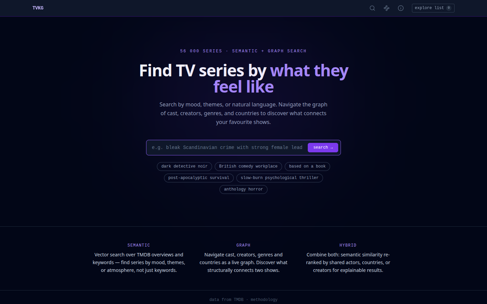

*Home page. A search box that goes to `/search?q=…` (semantic mode), six example queries (`dark detective noir`, `post-apocalyptic survival`, …), a three-column explanation of semantic, graph and hybrid search, and the TMDB attribution.*

## Search (`/search`)

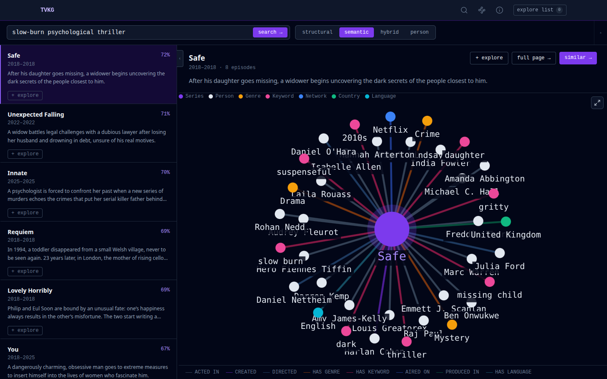

*Semantic search for "slow-burn psychological thriller". Left: ranked results with the match percentage. Right: the selected series, its overview and its depth-1 graph (violet = series, white = person, amber = genre, pink = keyword, blue = network, green = country, cyan = language). Captured 2026-10-04.*

| Mode | Backend behaviour (see [`graph-series_backend`](https://github.com/GKatzer/graph-series_backend)) | UI |
|---|---|---|
| `semantic` (default) | nearest neighbours of the query embedding in Qdrant | card shows the cosine similarity as a percentage |
| `structural` | full-text match on series names in Neo4j | same cards; the score is the database's full-text relevance, shown as a plain number |
| `hybrid` | semantic candidates re-ranked with graph signals | same cards; the score is cosine similarity plus bonuses, shown as a plain number (can exceed 1) |
| `person` | full-text match on person names | cards show the number of series; the right side lists the person's series with their role (acted / directed / created) |

Details:

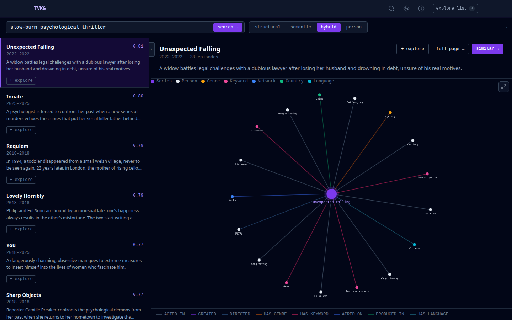

*The same query in hybrid mode (captured 2026-10-04): the cards show the hybrid score (cosine similarity plus graph bonuses) as a number such as `0.81`, not a percentage. `formatScore()` in `nextjs/lib/utils.ts` decides how a score is shown per mode.*

- The query lives in the URL (`?q=…`, and `&sel=<tmdb_id>` for the selected card), so a search can be shared and the browser's back button works. The mode is held in component state, not in the URL.
- Search runs on submit. Results are always requested with `limit=20` (`persons`: 20).
- The first result is selected automatically; clicking another card selects it and updates `sel` without adding a history entry.
- Each card has `+ explore` (toggles the bookmark and shows a toast). The selected series has `full page →` and `similar →`.
- A failed request shows a red message such as `Search failed (HTTP 500), try again` instead of the "No results" panel; an empty answer still shows "No results".

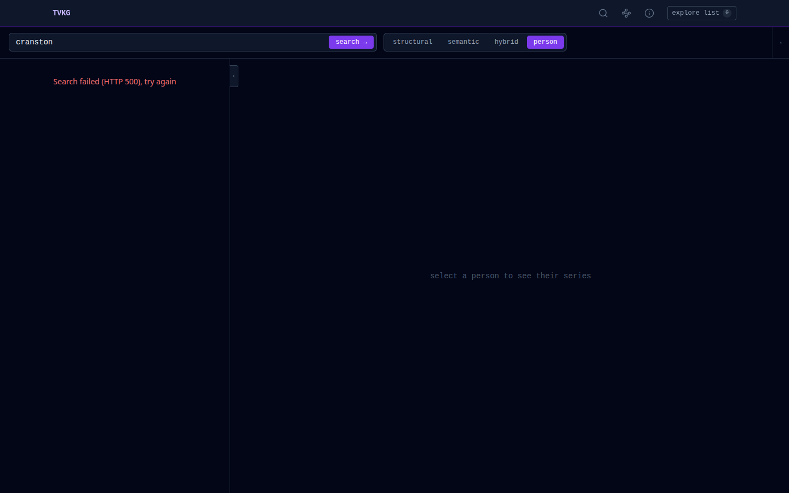

*The error state. **Simulated**: the capture proxy answered the person-search request with HTTP 500 (`SIMULATE_500` in `docs/examples/dev-proxy.mjs`); the deployment itself was healthy at the time.*

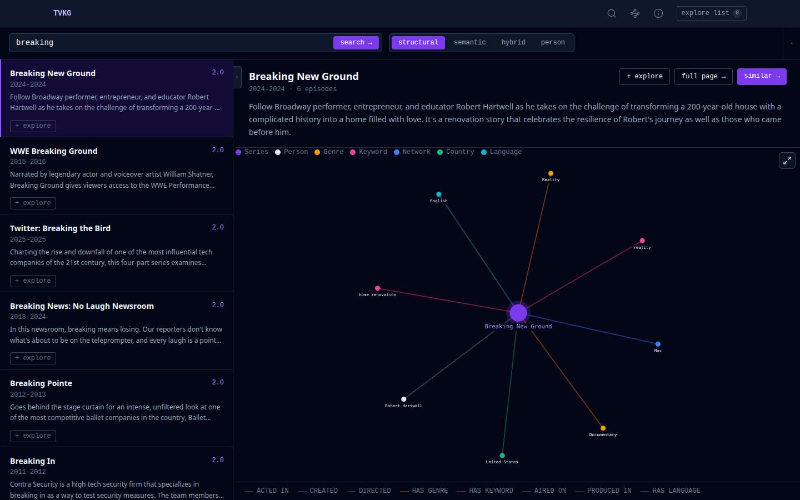

*`structural` mode (full-text match on titles) for "breaking"; the number on a card is the database's full-text relevance.*

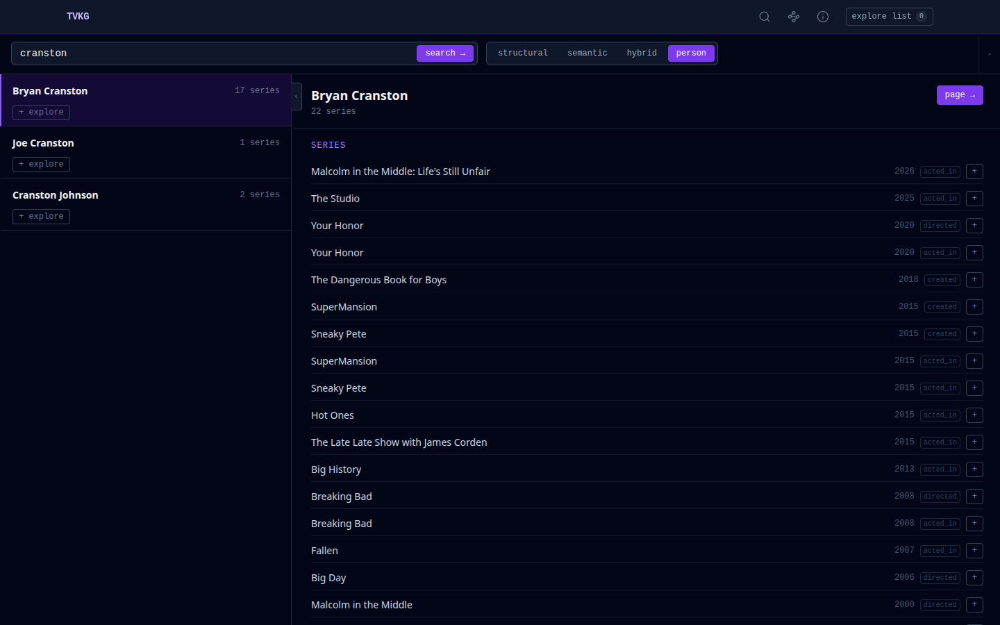

*`person` mode: the left list shows each person with a series count (17 for Bryan Cranston); the right side lists the person's series with their roles. The right-hand list has 22 rows because a series appears once per role (for example *Your Honor* as actor and as director), so the two numbers differ.*
- The top bar (`CollapsibleTopBar`) collapses to a thin strip; the result list is a `ResizablePanel` (drag to resize, collapse to a vertical label).

## Series page (`/series/[id]`)

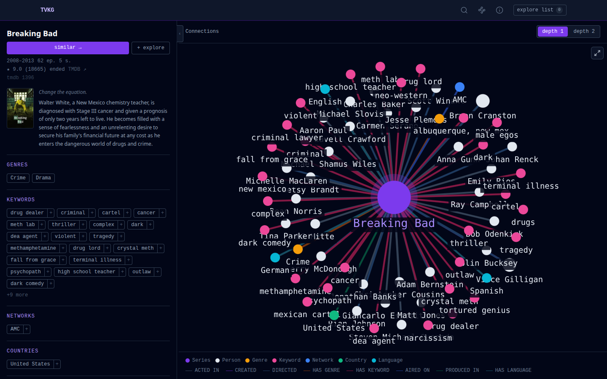

*Series page for TMDB id 1396 (Breaking Bad). The graph shows 66 nodes and 67 edges at depth 1 (29 persons, 29 keywords, 2 genres, 3 languages, 1 network, 1 country, the series). Captured 2026-10-04. The poster is loaded from TMDB's image CDN (poster artwork belongs to its rights holders; see the TMDB attribution above).*

Left panel (resizable, collapsible): title, buttons `similar →` and `+ explore`, years, episode and season counts, rating (shown only if the show has votes), status, a `TMDB ↗` link, the TMDB id, tagline, overview with poster, then facets:

- **Genres** are plain badges (the detail endpoint returns names only, so they cannot be bookmarked from here).
- **Keywords** (first 20, `+N more` expands), **Networks**, **Countries**, **Languages** are badges with a `+` that adds the facet to the explore list. Keyword ids are not in the detail response, so the page looks them up by name in the depth-1 graph it loads anyway.
- **Cast & Crew**: creators, directors and actors (first 20 actors, then `+N more`), each linking to the person page with a `+` bookmark.

Right side: the mini graph with a **depth 1 / depth 2** toggle (stored in the URL as `?depth=2`). If a depth-2 request fails, the page falls back to depth 1. If the series cannot be loaded the page shows the error (`Loading series failed (HTTP 404), try again`) instead of redirecting; a failure to load the cast and keyword ids behind the `+` buttons shows a toast.

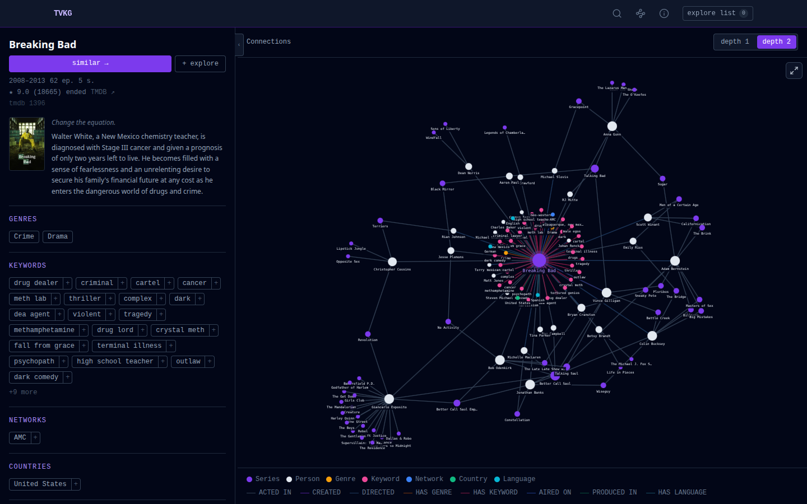

*`?depth=2`: the neighbourhood of the neighbours (Breaking Bad, captured 2026-10-04).*

## Person page (`/person/[id]`)

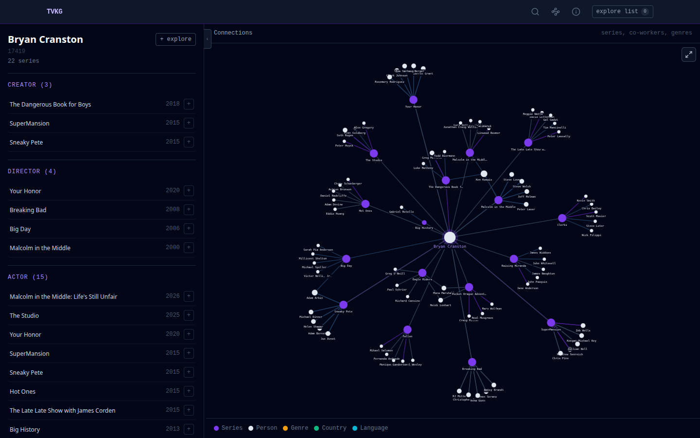

*Person page for TMDB person id 17419. Series are grouped by role (Creator, Director, Actor), newest first, each with a `+` bookmark. The graph shows the person's series and the people they worked with. The header says "22 series" but counts one row per role, so a series with two roles is counted twice (the search list says 17 distinct series). Captured 2026-10-04.*

## Similar series (`/similar/[id]`)

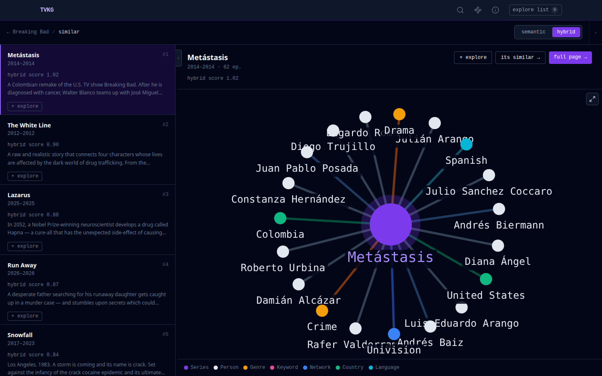

*Hybrid similarity for Breaking Bad. The first result has hybrid score 1.02: in hybrid mode the backend adds structural bonuses to the cosine score, so it can exceed 1, and the card shows it as `hybrid score 1.02` rather than as a percentage.*

A `semantic | hybrid` toggle (default hybrid). Cards show the rank, years, a badge and the overview. In hybrid mode the badge is `hybrid score N.NN · N shared actors · N shared countries`, listing only the parts that the API returned; cards added from the graph (`source: "graph"`) read `graph overlap N.N`. The selected result gets its own graph, `+ explore`, `its similar →` and `full page →`. `← <series name>` returns to the source series. If fewer than 10 vector neighbours exist, the backend fills the list from the graph; those cards come back with `source: "graph"`.

## Explore (`/explore`)

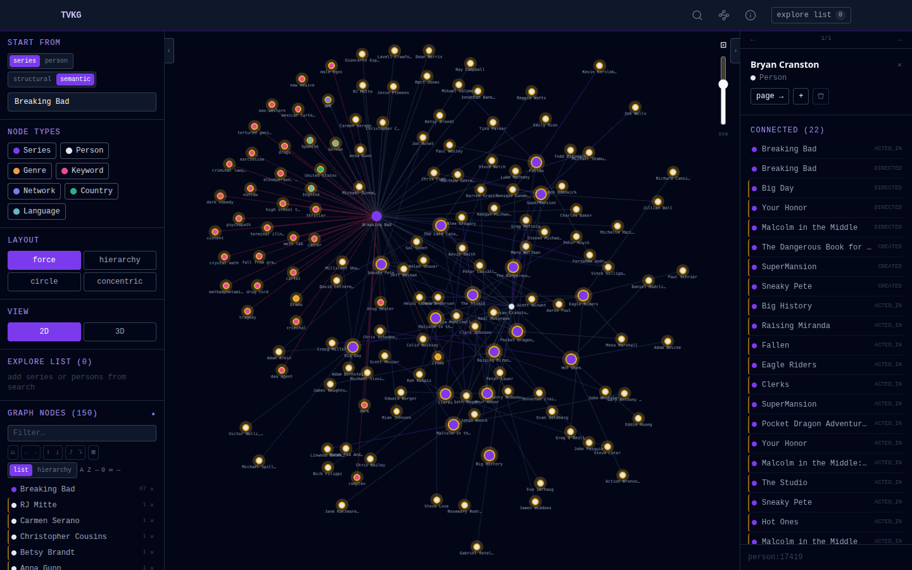

*The explore workspace: controls and node navigator on the left, Cytoscape canvas in the centre, selected-node panel on the right. Graph built from Breaking Bad with Bryan Cranston expanded (150 nodes at that moment). Captured 2026-10-04.*

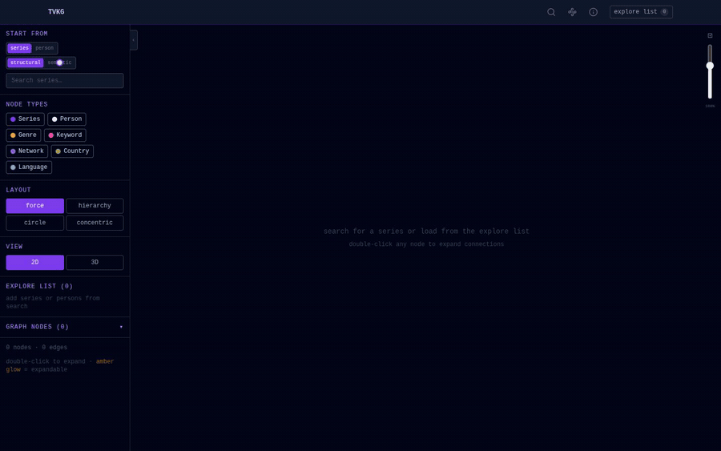

*Start from a series (semantic mode), open the node navigator, select Bryan Cranston, press Enter to expand, fit the view, switch to the concentric layout.*

### Building a graph

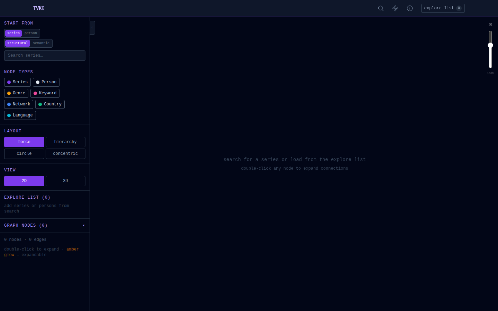

*Empty state: the controls on the left, an empty canvas saying "search for a series or load from the explore list" and "double-click any node to expand connections".*

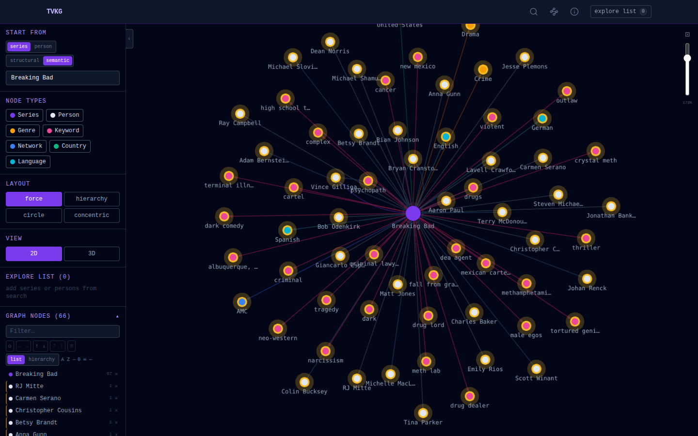

*One series loaded (Breaking Bad, depth-1 neighbourhood, 66 nodes) in the default force layout. Amber rings mark nodes that can be expanded; the navigator under "Graph nodes" lists them.*

- **Start from** (left panel): `series | person` and, for series, `structural | semantic`. Results appear in a dropdown (up to 8, 250 ms debounce, minimum 2 characters); picking one loads that node's neighbourhood. `hybrid` is not offered here. The default is `structural`.
- **Expand**: double-click (double-tap) a node whose border glows amber; or select it and press `Enter`; or use `expand +` in the right panel. Expansion fetches the node's neighbourhood and merges nodes and edges that are not on the canvas yet; a failure shows a toast (`Expanding node failed (HTTP …), try again`). Series expand with the depth-1 graph, people with their graph, and genre, keyword, network, country and language nodes with the "hub" graph (top series by popularity, 50). A node that is already expanded loses the amber glow; double-clicking it opens its page (series or person).
- **Explore list** block: bookmarked items; items already on the canvas centre the view on click, the others have a `+` that loads them into the graph.
- **Remove**: `✕` in lists or the trash button removes a node and also drops neighbours left without any edge.
- **Clear graph** removes everything on the canvas but keeps the explore list.
- **Node types**: seven toggles (Series, Person, Genre, Keyword, Network, Country, Language) hide and show nodes by label.

### Layouts and views

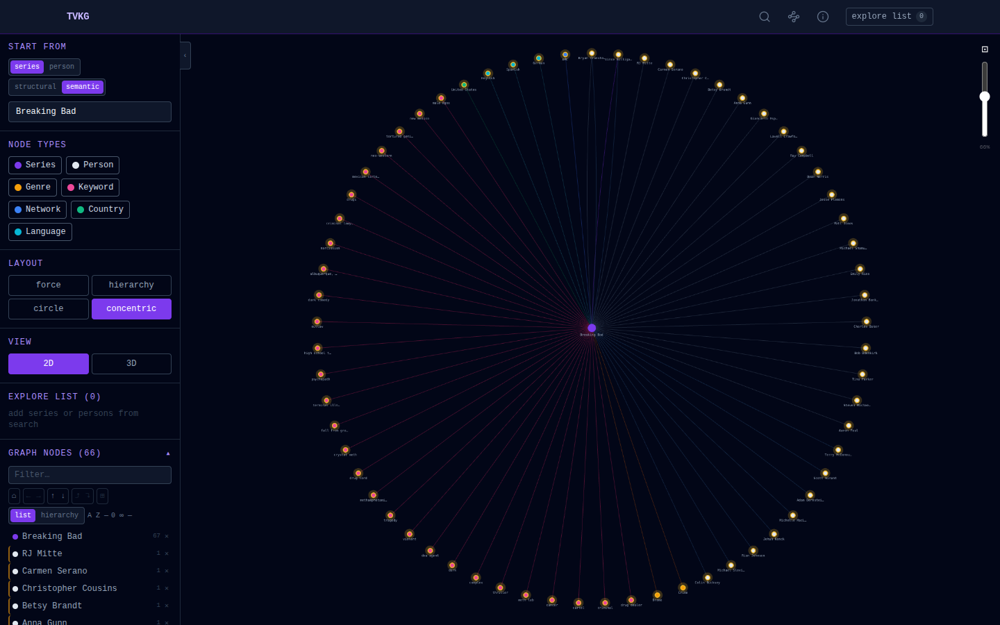

*Concentric layout: nodes ring around the series by degree.*

| Layout | Engine | Notes |
|---|---|---|
| `force` | Cytoscape `cola` (physics) | default; a short settle pass runs after dragging a node |
| `hierarchy` | `dagre`, top to bottom | a star-shaped graph becomes two rows ([screenshot](media/explore-layout-hierarchy.png)) |
| `circle` | built-in | [screenshot](media/explore-layout-circle.png) |
| `concentric` | built-in, ring by degree | |

A `2D | 3D` switch renders the same nodes and edges with `react-force-graph-3d` ([screenshot](media/explore-3d.png)). The 3D view is read-only: it has no node expansion, and it receives nodes and edges from the 2D graph. Its canvas is sized to the panel (earlier builds used the window size, which put the graph off-centre).

On desktop a vertical slider (logarithmic, 0.05× to 6×) and a "fit to view" button sit at the top right of the canvas. On touch devices zoom is by pinch.

Hovering a node dims everything outside its neighbourhood and highlights its edges. Dragging a node saves positions and re-runs the layout.

### Selected node panel

Click a node (or an item in the navigator) to select it. The right panel shows its name, label, links (`page →` for series and people, `similar →` for series), a bookmark toggle, `expand +` (if not yet expanded), a remove button and the list of connected nodes with the edge type (`ACTED_IN`, `HAS_GENRE`, …). Clicking a neighbour centres the canvas on it; amber bars mark neighbours that can still be expanded. A `←  n/m  →` strip is the selection history; `Alt+←` and `Alt+→` do the same. The footer shows the node id (`person:17419`).

### Graph node navigator

A collapsible block in the left panel that lists every node currently on the canvas, because on a dense graph labels are not enough.

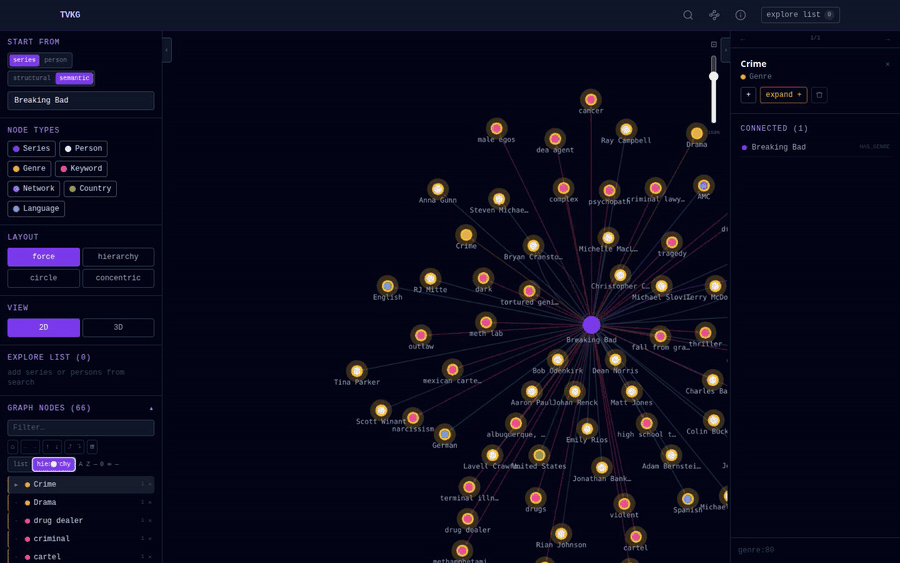

*Navigator in hierarchy mode on a one-series graph: ↓ walks the top-level nodes (Crime, Drama, drug dealer), Enter on `drug dealer` loads its series (45 connected nodes), Enter again descends into them, Esc returns to the parent, `T` shows parents, siblings and children of the selection.*

- **List mode**: all visible nodes, optional filter (substring, case-insensitive), sorting by name (`A Z`) and by degree (`0 ∞`), each toggling ascending, descending, off.
- **Hierarchy mode**: three levels. L1 = Genre, Keyword, Network, Country, Language; L2 = series connected to that L1 node; L3 = people connected to that series. Series with no L1 node on the canvas appear as "orphan series", people with no series as "orphan persons". The same node can appear under several parents.
- **Tree view** (`T`): context of the selected node, with parents, siblings and children.
- Selecting an item pans the canvas to the node without changing zoom (300 ms animation).

| Key | Action |
|---|---|
| `↑` / `↓` | previous / next visible item |
| `Enter` | expand the selected node if it can be expanded; otherwise go to its first child (hierarchy) or to the next item |
| `Esc` | go to the parent in the hierarchy (switches to hierarchy mode, remembers the previous view) |
| `H` | home: reset filter, return to list mode |
| `T` | toggle the tree view |
| `Alt+←` / `Alt+→` | selection history back / forward |

Shortcuts are ignored while a text field has focus.

## Methodology (`/methodology`)

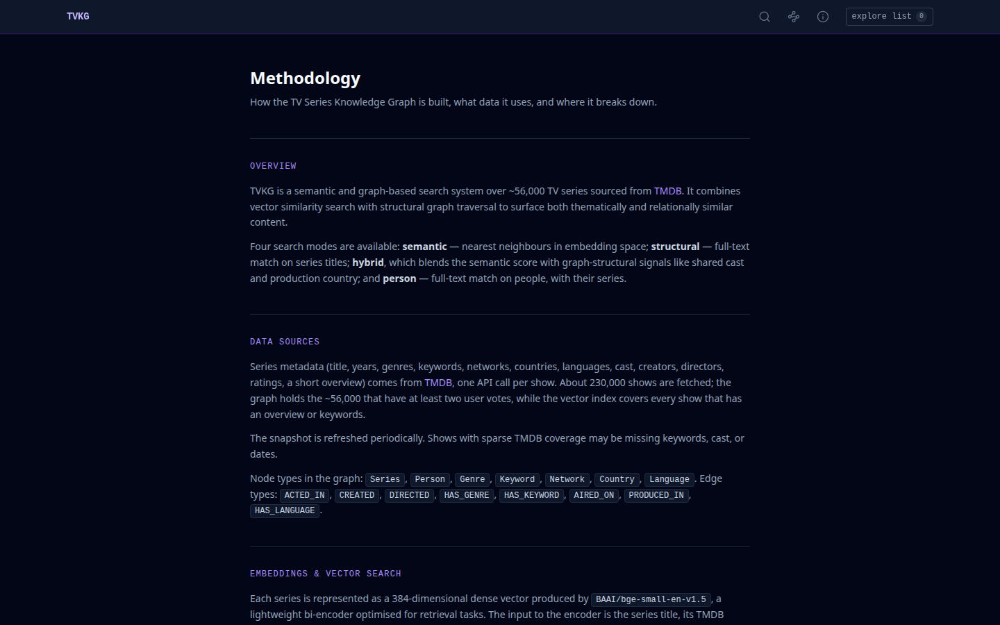

*A static page: overview, data sources, embeddings and vector search, graph structure, hybrid similarity, limitations (coverage, cast completeness, language, freshness) and stack, with the TMDB attribution.* The page was corrected on 2026-10-04 to match the code: four search modes, the `cola`/`dagre` layouts, how scores read per mode, English genre names.

## Mini graphs

The graph on the search, series, person and similar pages is a `react-force-graph-2d` canvas shared through `BaseGraph` in `components/SeriesGraph.tsx`: the centre node is large and labelled, node size follows degree, links are coloured by relationship type. Click or tap a node to open its page (series or person; other labels do nothing), `Ctrl`/`Cmd`+click opens it in a new tab, hovering dims unrelated nodes, nodes can be dragged. The fullscreen button (top right of the canvas) enlarges the graph over the page, `Esc` leaves it. A failed graph request shows the error in place of the canvas.

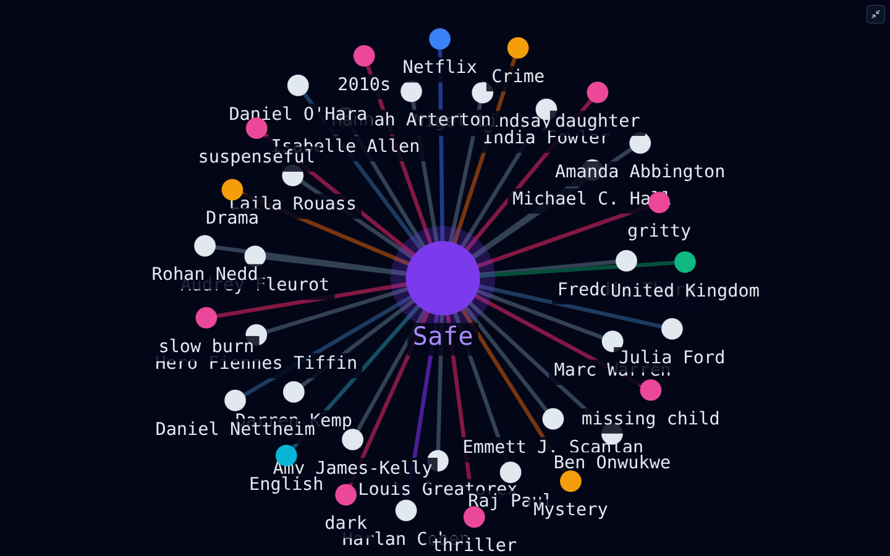

*Fullscreen mini graph for the first search result (captured 2026-10-04).* Clicks are hit-tested by the component itself, because `react-force-graph` only reports a click on a node that was hovered first, which never happens on a touch screen.

## What is saved in the browser

| Key (`localStorage`) | Content | Cleared by |
|---|---|---|
| `tvkg-explore-list-v2` | bookmarks (`id`, `name`, `type`) | `clear` in the header menu, `✕` per item |
| `tvkg-explore-graph-v2` | Cytoscape elements (with positions) and the set of expanded nodes; written after every change | `clear graph` |
| `explore-layout`, `explore-filters`, `explore-is3d`, `explore-nodes-view`, `explore-sort-name`, `explore-sort-degree`, `explore-nav-open` | layout, node-type filters, 2D/3D, navigator view, sort directions, navigator open | not cleared by `clear graph` |
| `tvkg-panel-<key>` | `{ width, collapsed }` of a side panel (`explore-left`, `explore-detail`, `search-results`, `series-info`, `person-info`, `similar-results`) | not cleared |
| `tvkg-topbar-<key>` | `{ collapsed }` of a top bar (`search-top`, `similar-top`) | not cleared |

The `-v2` suffix exists because ids changed from Wikidata Q-ids to `label:key` node ids during the move to TMDB; the old keys `tvkg-explore-list` and `tvkg-explore-graph` are deleted on load.

## Mobile layout

A "mobile" viewport is narrower than 768 px **and** portrait (`useIsMobile`); a phone held in landscape gets the desktop layout. Differences:

- **Search**: the result list fills the screen; tapping a card opens a full-screen detail view with a `← back to results` bar; the mode picker is an inline popover instead of tabs.
- **Series and person pages**: one scrolling column instead of two panels. **Search and similar**: the list comes first and tapping a card opens the detail.
- **Side panels** become off-canvas drawers with an edge tab; the explore controls and details open from the sides.
- **Zoom slider** is hidden; pinch to zoom.

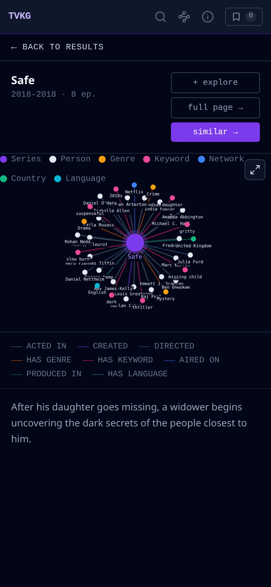

*Mobile (390 × 844): the detail view for a search result, with the fullscreen button over the graph.*

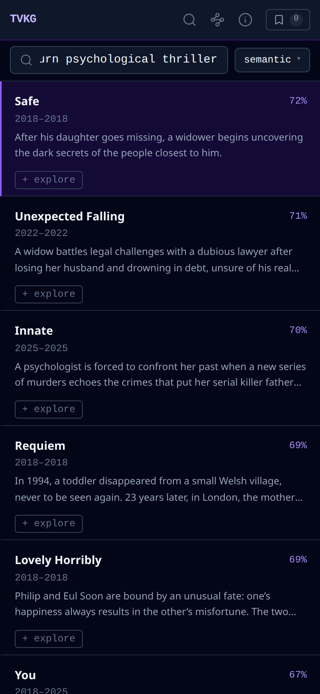

*Mobile search: the result list is the primary view; tapping a card opens the detail shown above.*

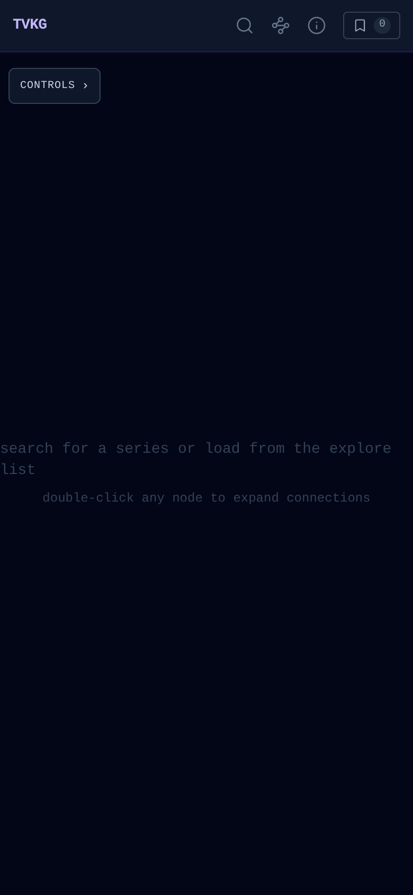

*Mobile explore, empty state: controls are in an off-canvas drawer (`CONTROLS ›`), and the empty-state text overflows the left edge in this capture.*

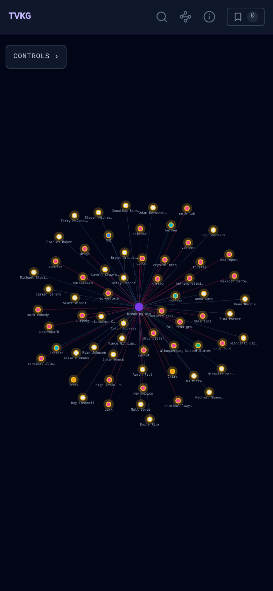

*Mobile explore after loading a series from the `CONTROLS` drawer (captured 2026-10-04).*

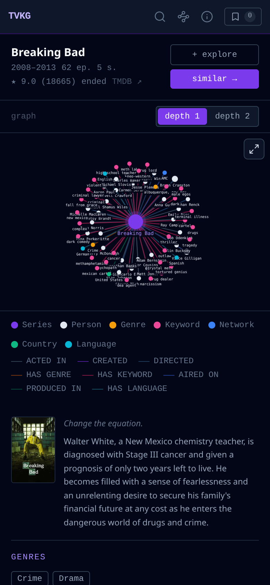

*Mobile series page, scrolled to the top: the graph appears before the facets.*
